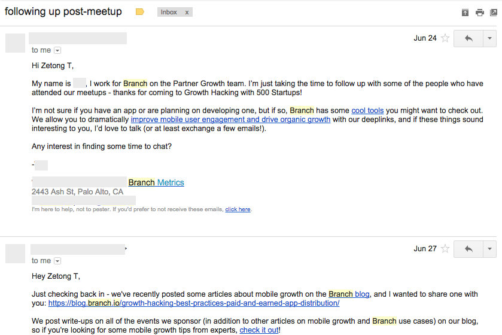
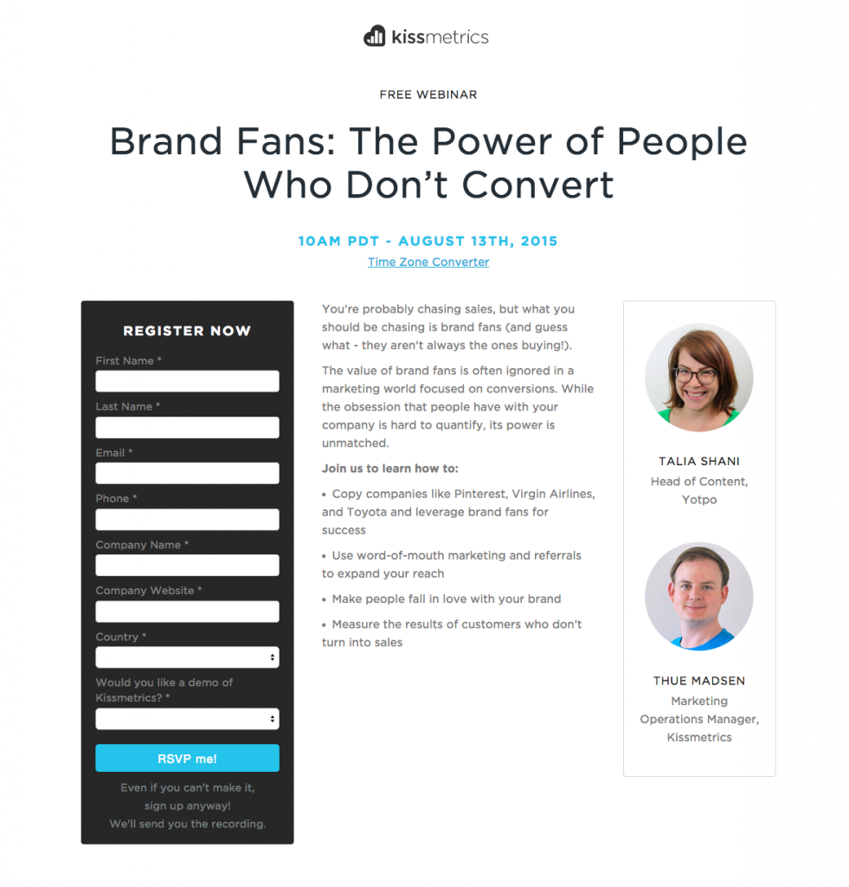
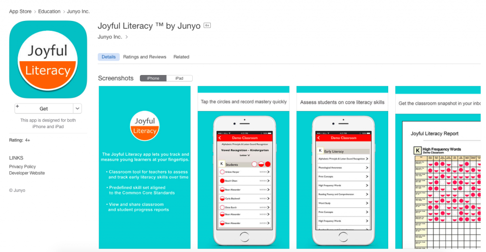

Over the past twelve months, I was fortunate to be part of a college program that sends students down to Silicon Valley and work for startups for a year. I worked as a marketer at an edtech (education technology) startup based in Menlo Park, and had picked up many valuable lessons from my supervisor and my colleagues. I hope all these important tips I have picked up from this stint will benefit you too, and I hope to share them with you so you can benefit from what I&#8217;ve learnt too.

<!--more-->

### Email marketing campaigns

No matter what others have to say about &#8220;emails are only read by grandparents&#8221;, they still work like a charm. When people no longer read tweets, they will still open up their inbox and read their emails, just like how we are still used to checking our mailbox.

Over the year, I&#8217;ve planned and executed multiple email marketing campaigns during my term as a marketer, reaching out to more than 20,000 contacts. Having conducted more than ten different A/B tests on the email campaigns, I did learn quite a few things:

&nbsp;

#### The more personalized the emails, the higher the open rates.

More and more companies are using this approach of having a personalized emails. By this, I found out that the more a personalized email one company sends out, the higher open rates, click-through rates and even response rates that email will have.

Everyone wants to be nice, and thus, it feels hard not to reply to a personal email that you&#8217;ve received.

The better ones are those with follow-up emails that goes by the rules if you have responded to the first emails. It creates a strong image that the person is engaging to you one-to-one.

<address style="text-align: center;">
  Personalized email from branch.io 
</address>

&nbsp;

#### The schedule of the email does matter.

Monday is for the hangover to catch up on the work. Tuesdays and Thursdays work best for open rates, Fridays is the best for click-through rates and Sunday is the day you want to dish out your free e-book downloads. Many people read books during the weekends. If the majority of your mailing list resides in the United States, you would want to send the email between 1pm-3pm PST. This timeframe acts like a catch-all for both the east and west coast.

&nbsp;

#### Creating Landing Pages

The most basic requirement of all marketing campaigns, landing pages are required for marketers to track our campaigns efficiently. A landing page provides you with the signup form (or the opt-in form) that you can collect the email addresses of those who are interested in what you are offering, and you can connect with them through the email marketing. By doing so, you are effectively putting all of the signups into a marketing funnel. Then, you slowly convert them into paying customers.

This is the part which crosses to web development skills, so you not only need to know marketing, but also some HTML and CSS (It is not that hard).

**Make Use of Free Resources Online**

I&#8217;ve created a few landing pages on my own. I feel that because marketers have to do so many different things to execute their marketing campaigns, they have to be relentlessly resourceful to find useful online tools. There are many free tools online such as [Strikingly](http://strikingly.com) and [Launchrock](https://www.launchrock.com/), which can easily help one create a landing page in minutes. Email collection can be first started using [MailChimp](http://mailchimp.com) or [SendGrid](http://sendgrid.com).

<address style="text-align: center;">
  A landing page for Kissmetrics webinar
</address>

**Always measure your results**

Previously, I organized a webinar for my company, and I would love to track the effectiveness of the webinar. First, I created a landing page with [Hubspot](http://hubspot.com), the marketing automation software my company has subscribed in minutes. All the signups of the form will be recorded and tracked in the software. Then, I integrated the Go-To-Webinar software on the Hubspot platform, which automatically converts the Hubspot&#8217;s landing page signups to Go-To-Webinar signups.

Once the landing page is up, I sent cold emails (which was bought earlier) to many people who are in the field. Our guest speaker has quite a reputation in the education funding field, and thus, we got many signups on the first few days of the campaign.

**Make Use of Your Homepage**

However, I wanted more signups. So, I added a top bar on the Homepage of the product webpage because usually, the home page has the highest amount of traffic! The top bar acted like an announcement to all the visitors of our website. Nearing the date of webinar, I sent out a reminder email to all the registrants, I believe this will improve the attendance rates.

&nbsp;

### Designing Visual Content

I&#8217;m quite a visual guy, or do I not look like one? So in marketing, besides handling communications and getting more people to sign up for your stuff, we also create the collaterals to be used in the marketing campaign.

<address style="text-align: center;">
  I&#8217;ve designed the logo and screenshots with PowerPoint
</address>

I was very fortunate to be able to flaunt my nascent design skills in a mobile app my company is launching. At the start, I was not well-versed with Photoshop. I was much more comfortable with MS PowerPoint, and later on, Keynote. Many have used them as the tool to powerfully raise their points, but few realize the design potential of these software. If your design does not require abstract digital art, you often do not need the tools in Photoshop. PowerPoint has got you covered to design a decent-looking logo.

(Note: Do not use PowerPoint and Keynote to design for prints, please stick to Adobe Photoshop or Illustrator for that matter.)

UPDATE: According to one of my design friends, Samuel Cho, Adobe InDesign is more suitable for print.

&nbsp;

### SEO Audit &#8211; You will feel really lost, it&#8217;s okay

I was also tasked to analyze the SEO of one website. Despite having read so many articles on how to optimize your web pages for search engines, I find it incredibly hard to practice what I&#8217;ve read. I found out that it is not esay to quantify the SEO standards of a particular website.

&nbsp;

**Every Website Has Both On-the-page and Off-the-page SEO**

Fortunately, I found a comprehensive guide written by [Search Engine Land](http://searchengineland.com/guide/seo) and followed their framework of using on- and off-page SEO to figure out whether a website is doing well on its rankings. According to the article,

  The on-the-page SEO consists of:

**Content** &#8211; does your website produce content people like and share? does it contain the important keywords related to what people are searching for?

**Architecture** &#8211; What is your time to first byte (TTFB)? Does your map has a sitemap? How fast does it load from the server?

**HTML** &#8211; are the H1, H2, H3 tags properly labelled and clearly defined in the website?

  off-the-page SEO consists of:

**Trust** &#8211; how much authority does your website have? does it engage the audience?

**Links** &#8211; are there other websites which are linking to your content?

**Personal** &#8211; is there localization involved in your website?

**Social** &#8211; how much social reputation does your website have across major social channels?

&nbsp;

These are the several tools which I&#8217;ve found useful in auditing a website for SEO:

<a href="https://www.google.com.sg/url?sa=t&rct=j&q=&esrc=s&source=web&cd=1&cad=rja&uact=8&ved=0CBwQFjAAahUKEwi01siC4aXHAhXKB44KHZ9cAuQ&url=https%3A%2F%2Fwww.pingdom.com%2F&ei=A2XMVfTIBMqPuASfuYmgDg&usg=AFQjCNFZCkTAhHalF8D92YiQWF69x7X8Qw&sig2=8fmj2llvQWFqm1lGLiK5eg&bvm=bv.99804247,d.c2E" target="_blank">Pingdom</a> &#8211; how fast is your website

<a href="http://quicksprout.com" target="_blank">Quicksprout SEO Grader</a> & <a href="https://moz.com/researchtools/ose/" target="_blank">Open Site Explorer</a> &#8211; it provides me with a summary of how one website is doing in terms of SEO, and I can focus my efforts in analyzing the areas which the website isn&#8217;t doing so well in website architecture

<a href="https://adwords.google.com.sg/KeywordPlanner" target="_blank">Google Adwords Tool</a> &#8211; in figuring out the useful keywords one would use

&nbsp;

### My Thoughts as a Digital Marketer &#8211; You must be the Best Jack of All Trades

This career path is as ambiguous as one can get. It is not clearly defined, yet. One day, we are called the growth hackers,  the next day we are called the technical marketers, then we are also named the digital marketers. In essence, a data-driven online marketer should now be a combination of data analysts, web developers and marketers. We are the Jack of all trades, and in order to score the job, everyone aims to be the best Jack.

I&#8217;ve recently read couple articles on how to become an user acquisition expert or simply becoming a growth hacker. All these require you to have a skill set from different occupations. Whether or not will it make us a generalist, it doesn&#8217;t matter, because at the end of the day, we want to keep track of all our marketing campaigns, know how to improve on those, and implementing those campaigns ourselves. When it comes to the day that the individual skills become too sophisticated for one to pick up everything, online marketers will then assume a managing role similar to that of a product manager in planning marketing campaigns.

Therefore, I&#8217;m frantically trying to pick up the various skills needed. Follow me on my journey as I get out of college and learn the ropes to become the next best online marketer. Join my mailing list and be the first to read my next article!

&nbsp;

_Thank you Si Quan Ong, Sean Tan and Jacinda Siew for reading the drafts._

&nbsp;

&nbsp;